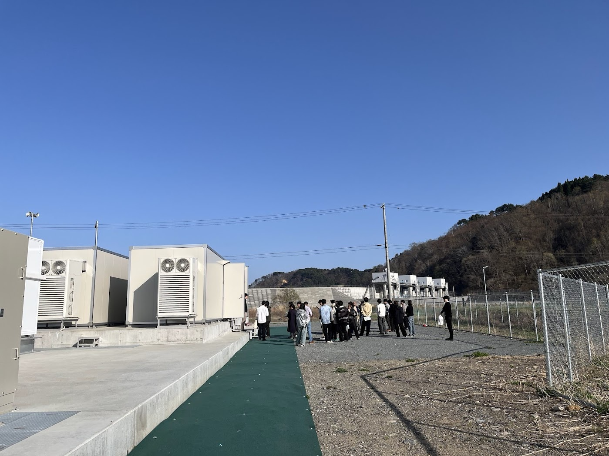

## 1. Overview of Visited Sites

## 1. 宮古市田老地区の概要

宮古市田老地区は、岩手県の三陸沿岸に位置する地域である。三陸沿岸はリアス式海岸が続く地形であり、津波が湾内で増幅されやすい特徴を持つ。そのため、田老地区は古くから津波常襲地域として知られてきた。

田老地区では、1896年の明治三陸津波、1933年の昭和三陸津波など、過去に大きな津波被害を繰り返し経験してきた。特に明治三陸津波では、地震の揺れが比較的小さかったにもかかわらず巨大な津波が発生し、住民の避難が遅れたことで甚大な被害が生じた。また、昭和三陸津波でも深夜に発生した地震と津波により、多くの集落が被害を受けた。

こうした経験を踏まえ、田老地区では防潮堤の建設、避難路の整備、防災教育など、長年にわたり津波防災対策が進められてきた。田老の防潮堤の建設には日本公園の父とも呼ばれる本田静六が関わっており、津波の侵入を防ぐための巨大な構造物が整備された。高さ10.65m、総延長2,433mに及ぶ大規模な構造、さらに地域全体を覆う2重構造は、「万里の長城」とも呼ばれた地域の防災能力の高さを象徴する存在であった。

<picture>
  <source srcset="{{ '/assets/images/authors/taro-furuhashi-post/01.jpg' | relative_url }}">
  
</picture>

しかし、2011年の東日本大震災では、これらの対策が存在していたにもかかわらず、津波が防潮堤を越流・破壊し、市街地に大きな被害をもたらした。この点で田老地区は、「防災施設があっても、想定を超える災害に対してどのような限界があるのか」を考えるうえで重要な事例である。

## 2. 震災時の状況

2011年3月11日に発生した東日本大震災では、地震発生から約40分後に田老地区へ津波が到達した。田老地区には大規模な防潮堤や水門、護岸施設が整備されていたが、津波はそれらを越え、市街地をのみ込んだ。

震災前の田老地区では、ハード対策とソフト対策の両面から津波への備えが行われていた。ハード対策としては、防潮堤を中心に、水門や護岸施設を組み合わせた多重的な防御構造が整えられていた。これにより、津波の侵入を抑え、市街地への浸水を防ぐことが期待されていた。

一方、ソフト対策としては、防災無線や警報による情報伝達、避難路や高台避難場所の設定、避難訓練、学校教育などが行われていた。また、田老地区の市街地は、海と山の位置関係を把握しやすい道路配置となっており、道路が山側へ向かうように設計されていた。交差点には「隅切り」が設けられ、避難時の見通しや移動のしやすさにも配慮されていた。

これらの対策は一定の効果を持っていた。防潮堤は津波の到達を遅らせ、避難時間の確保に寄与したと考えられる。また、避難訓練や防災教育の成果により、地震直後に高台へ避難した住民もいた。昭和三陸津波後に整備された避難道路も、実際に避難に利用された。

しかし、津波の規模は想定を大きく上回っていた。高さ10.65mの防潮堤は津波によって越流・破壊され、市街地は広範囲に浸水した。田老地区では181人の死者・行方不明者が発生し、多くの住宅が流失した。震災遺構として保存されている田老観光ホテルは、その津波被害を伝える象徴的な建物となっている。

<picture>
  <source srcset="{{ '/assets/images/authors/taro-furuhashi-post/03.jpg' | relative_url }}">
  
</picture>

過去の津波被害と比較すると、田老地域の死者・行方不明者は、1896年の明治三陸津波で1,859人、1933年の昭和三陸津波で911人、2011年の東日本大震災で181人とされている。この数字から、長年の防災対策や避難行動が被害軽減に一定の効果を持ったことは評価できる。しかし同時に、構造物だけでは最大クラスの津波を完全に防ぐことはできないという限界も明らかになった。

## 3. 震災後の復興

東日本大震災後の田老地区では、単に被災前の状態へ戻すのではなく、災害リスクを前提に地域の構造を組み替える復興が進められた。その中心にあるのは、津波を完全に防ぐことを目指す発想から、人命を守り、被害を減らし、災害後も地域が機能し続ける仕組みをつくる発想への転換である。

この転換は、防潮堤や高台移転などの防災まちづくりだけでなく、再生可能エネルギーや蓄電池を活用した地域エネルギーシステムにも表れている。田老地区の復興は、防災、脱炭素、地域経済、エネルギー自治を結びつける試みとして理解できる。

### 3.1 防潮堤の限界から、多重防御のまちづくりへ

震災前の田老地区には、巨大な防潮堤を中心としたハード対策と、避難訓練・防災教育・避難路整備などのソフト対策が存在していた。しかし、東日本大震災の津波はそれらの想定を上回った。この経験を踏まえ、震災後の津波対策では、二つのレベルの津波を想定する考え方が重視されるようになった。比較的発生頻度の高い津波に対しては海岸堤防などで人命・財産・経済活動を守る一方、最大クラスの津波に対しては、住民の避難を軸に、ハード・ソフトの施策を組み合わせる方針である。

田老地区の復興まちづくりでも、防潮堤の整備だけでなく、災害危険区域の設定、高台住宅地の整備、市街地の一部嵩上げ、国道45号の嵩上げ地への移設、高台住宅地へ接続する道路整備などが組み合わされた。これは、一つの構造物で津波を止めるのではなく、土地利用、避難、交通インフラ、居住地配置を重層的に組み合わせる多重防御の考え方である。

### 3.2 震災跡地を地域電源へ変える

今回、宮古市の方々に案内いただき、田老地区の太陽光発電設備と蓄電池を見学した。特に印象的だったのは、震災跡地を単なる未利用地として残すのではなく、地域のエネルギー供給を支える場所として活用している点である。

田老地区では、既設の田老太陽光発電所に加え、2025年12月に夜間連系太陽光発電所が事業を開始した。夜間連系太陽光発電所は、パネル容量2,969kW、蓄電池容量7,987kWh、一般世帯換算623世帯分の規模である。既設の田老太陽光発電所はパネル容量2,356kW、一般世帯換算670世帯分であり、両者を合わせると約1,293世帯分を供給可能である。

夜間連系型の仕組みは、日中に発電した電力を蓄電池に充電し、夕方から夜間にかけて地域新電力へ売電するものである。これは、系統の空き容量が限られている地域で再生可能エネルギーを活用するための工夫であり、発電設備と蓄電池を組み合わせることで、電力を「つくる」だけでなく、「ためて、時間をずらして使う」仕組みをつくっている。

この取り組みの背景には、震災時に外部からの電力供給が途絶えた経験がある。災害時に自前で供給可能な電力源が必要だと感じたことが、地域内で再生可能エネルギーを確保する動機になったと理解できる。太陽光発電と蓄電池は、平常時には脱炭素化に貢献し、災害時には地域のレジリエンスを高める可能性を持つ。つまり、田老地区のソーラーファームは環境政策であると同時に、防災政策でもある。

<picture>
  <source srcset="{{ '/assets/images/authors/taro-furuhashi-post/04.jpg' | relative_url }}">
  
</picture>

### 3.3 宮古市版シュタットベルケ――地域でつくり、地域に還す仕組み

宮古市の取り組みは、「宮古市版シュタットベルケ」として位置づけられている。シュタットベルケとは、ドイツなどで見られる地域密着型の公共的事業体の仕組みであり、電力、熱、水道、交通などの生活インフラを地域主体で運営する考え方である。

宮古市の場合、単に太陽光発電所を設置するだけではない。市が太陽光発電所や地域新電力に出資し、そこから得られる配当や収益を、太陽光パネルや蓄電池の導入支援へ再投資する仕組みを構想している。この点で、宮古市版シュタットベルケは、地域内でエネルギーをつくり、その収益を地域課題の解決に回す循環型の政策である。

この仕組みには三つの意味がある。第一に、エネルギー自立性の向上である。外部電源に依存しきるのではなく、地域内に一定の発電・蓄電機能を持つことは、災害時の脆弱性を下げる。第二に、脱炭素化への貢献である。再生可能エネルギーを地域で使うことにより、化石燃料への依存を下げることができる。第三に、地域経済循環である。電力料金として域外に流出していた資金の一部を、地域内の設備投資や市民向け支援に戻すことが可能になる。

### 3.4 事業性の壁

一方で、現地を見学して強く感じたのは、シュタットベルケ型の事業は理念だけでは成立しないということである。筆者自身も簡単な収支計算を行って感じていたが、地域エネルギー事業は収支面で厳しい。発電設備、蓄電池、系統接続、保守管理、資金調達をすべて考慮すると、脱炭素や防災という公益性だけで事業を継続することは難しい。

宮古市では、この課題に対して、土地利用、補助金、契約形態、地域新電力との関係などを組み合わせながら対応していた。案内で伺った内容では、住宅等の建築が制限される区域を発電用地として活用すること、補助金を利用すること、地元でつながりのある電力公社との契約を工夫することなどにより、事業費を抑えているとのことだった。宮古市の災害危険区域では、第1種区域は予想浸水深が2m以上の地点を含む区域であり、住宅等の建築は禁止されている。 そのような土地を、居住ではなく再エネ設備の用地として活用する点に、復興後の土地利用の現実的な工夫がある。

特に印象に残ったのは、系統接続に関する費用差である。案内では、東北電力と新設契約を結ぶ場合には約2億円かかる一方、既存の電力公社との増設契約であれば約50万円で済んだと説明を受けた。公開資料上の数字として確認したものではないが、仮にこの説明どおりであれば、宮古市の取り組みは単なる理想論ではなく、制度・契約・地域ネットワークを組み合わせて事業を成立させようとする実務的な努力の上に成り立っている。

ただし、この発電方式にはリスクもある。第一に、収支リスクである。案内では、事業収支が黒字化するまでに約22年かかるとの説明があった。しかし、太陽光パネルや蓄電池の劣化、交換費用、保守管理費用を十分に織り込めば、採算性はさらに厳しくなる可能性がある。第二に、災害リスクである。津波リスクを前提とした土地に設備を置く以上、最大クラスの津波時には浸水リスクを避けられない。浸水時の電気設備の安全停止、漏電防止、復旧手順、保険設計などは、今後も重要な検討課題である。

このように見ると、宮古市版シュタットベルケは、単純に「再エネを導入した成功事例」としてではなく、公益性、採算性、災害リスク、制度制約の間で成立条件を探っている実践として捉えるべきである。

### 3.5 V2G・分散型電力グリッドの可能性と課題

今回の見学を通じて、V2Gに対する見方も変わった。これまで、V2Gについては研究テーマとしては理解していたものの、実装のリアリティを十分に実感できていなかった。しかし、宮古市のような自治体スケールで、地域新電力、太陽光発電、蓄電池、公共施設、EVを組み合わせる構想を見ると、V2Gは現時点でも十分に可能性のある領域だと感じた。

特に重要なのは、V2Gを単なる技術としてではなく、地域エネルギーシステムの一部として考えることである。EVは移動手段であると同時に、分散型蓄電池でもある。公共施設、公用車、路線バス、事業者の業務用車両、家庭用EVが地域内に分散して存在するなら、それらをどのように充放電制御し、非常時と平常時の双方で価値を出すかが重要になる。

一方で、本当に難しいのは、EVフリートを用いた分散型電力グリッドである。単一自治体内で公共的に調整できる設備であれば、意思決定主体は比較的明確である。しかし、複数の事業者、車両所有者、電力小売、系統運用者、自治体が関わる場合、利害調整は一気に難しくなる。特に、V2Gではビジネスモデルが重要であり、複数事業者間の競争によって、全体最適よりも個別最適が優先される囚人のジレンマが生じうる。

宮古市の事例は、分散型エネルギーシステムが机上の構想ではなく、自治体の防災、財政、土地利用、地域経済と結びついた現実の政策課題であることを示していた。

## 4. 感想

田老地区の事例から、防災対策には「備えていれば安全」という単純な考え方では不十分であることが分かる。田老には、巨大な防潮堤、避難路、防災教育、避難訓練など、他地域と比べても充実した対策が存在していた。それでも、東日本大震災の津波はそれらを上回り、大きな被害をもたらした。

このことから、構造物に依存しすぎる防災には限界があると感じた。防潮堤は不要だったということではない。実際に、防潮堤は津波の勢いを弱め、避難のための時間を稼ぐ役割を持っていた。しかし、防潮堤があるから避難しなくてもよいという意識が生まれれば、かえって危険である。最終的に命を守るのは、迅速な避難行動であり、その行動を支える教育、訓練、道路、情報伝達である。

また、震災後の田老地区の復興からは、災害後のまちづくりが単なる復旧ではなく、地域のあり方を見直す機会にもなることを学んだ。高台移転、多重防御、災害危険区域の設定、震災跡地の活用は、過去と同じ場所に同じ形で戻るのではなく、将来のリスクを前提に地域を再構成する取り組みである。

特に印象的だったのは、太陽光発電と蓄電池を活用した宮古市版シュタットベルケである。これは、脱炭素政策であると同時に、防災政策であり、地域経済政策でもある。震災時に電力が途絶えた経験から、地域内で一定の電力を確保する必要性が認識され、それが太陽光発電、蓄電池、地域新電力、市民向け支援へとつながっている。

一方で、現地で話を伺うほど、この取り組みが簡単な成功事例ではないことも分かった。収支が黒字化するまでに長い時間がかかり、設備の劣化や交換費用を含めれば採算性はさらに厳しくなる。さらに、津波リスクのある土地に電気設備を置く以上、災害時の安全性にも課題が残る。それでも、宮古市は補助金、土地利用、契約形態、地域新電力との関係を組み合わせながら、事業を成立させようとしている。この点に、自治体の意思決定と地域経営の難しさが表れている。

田老地区の経験は、防災、エネルギー、地域経済を切り離して考えることの限界を示している。これからの地域防災では、津波を完全に防ぐことだけを目指すのではなく、被害を減らし、命を守り、災害後も地域が機能し続ける仕組みをつくることが重要である。宮古市の取り組みは、そのための一つの実践であり、V2Gや分散型電力グリッドを研究するうえでも重要な示唆を与えてくれた。
